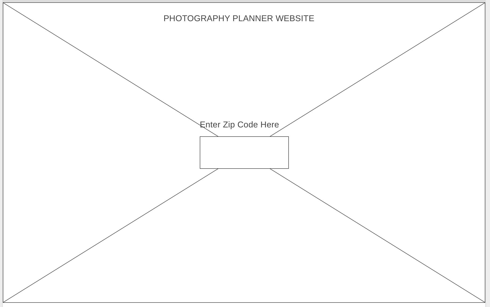

# The Golden Hour

## Project 2 - SEI

**The Golden Hour** is responsive React web application which will provide ideal outdoor photography forecasts based on weather and lighting conditions

## Features

**MVP:**

1. User inputs a zip code
2. The website will display a 5 day weather forecast to include conditions like %chance precipitation, sky conditions (cloudy, sunny, partly cloudy), visibility, and wind conditions.  
These are all factors which impact outdoor photography
3. When a user selects a day, they will be given more specific information about that day.  Specifically the Golder Hours and Blue Hours

**Post-MVP:**

1. Recognize popular zip codes/cities and to display landmarks and/or parks as ideas on where to take photos
2. Have backgrounds change on the weather cards depending on the sky conditions
3. Allow users to enter international city names in addition to US zip codes

# Technologies: HTML, CSS, REACT, AJAX
API used: https://api.weatherbit.io

## Wireframe

Desktop Layout

## My Journey
1. Converting sunset & sunrise time from UTC to user friendly format
2. Figuring out current date

## Stretch Goals

1. Use a carousel to display the weather cards and use advanced CSS technique to add movement to the page
2. Allow the browser to prompt for and capture location details to autofill the location
